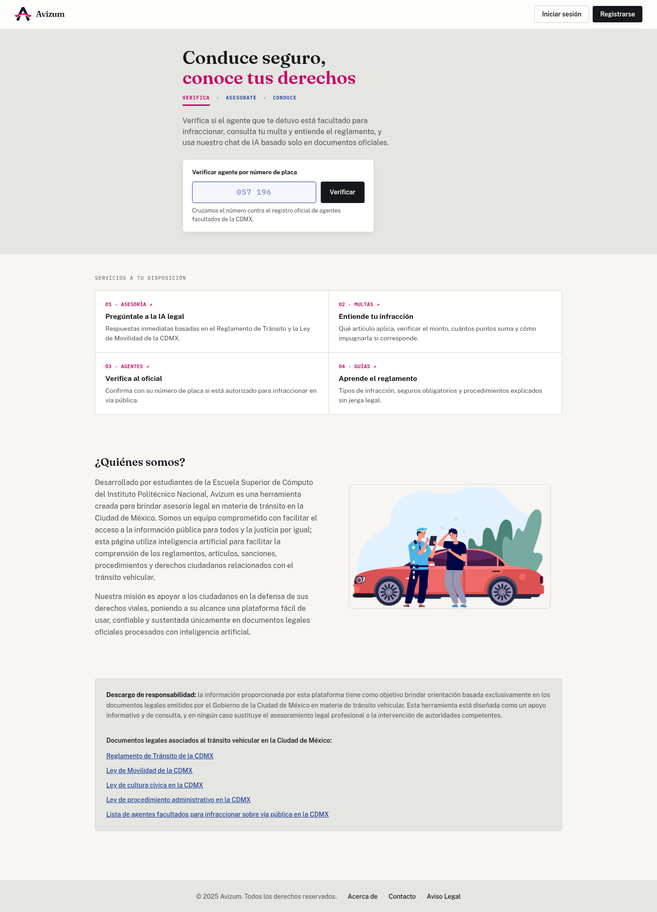
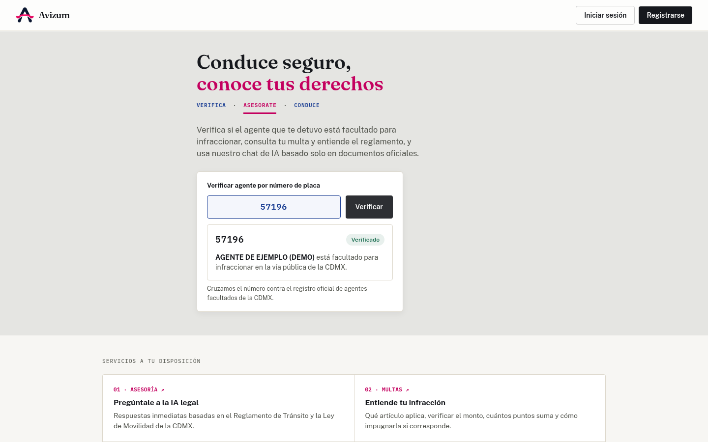
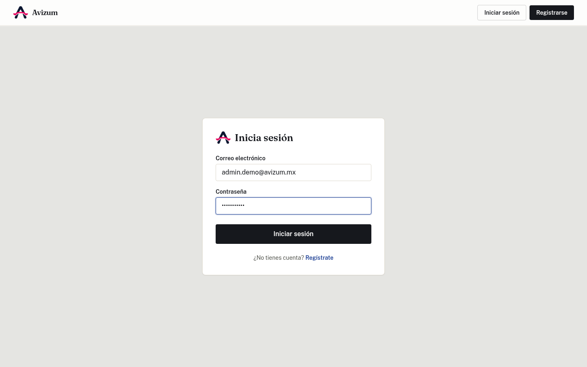
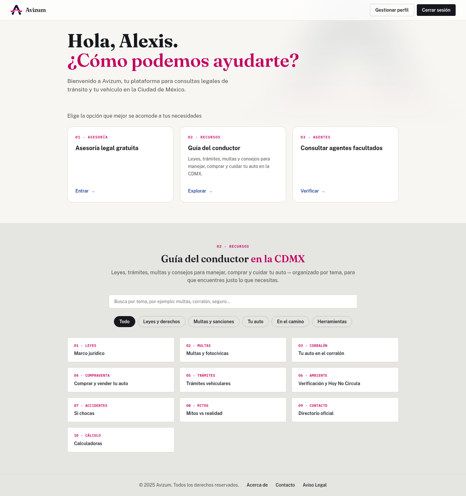
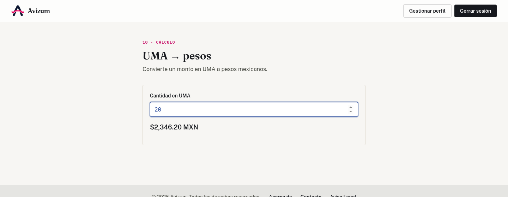
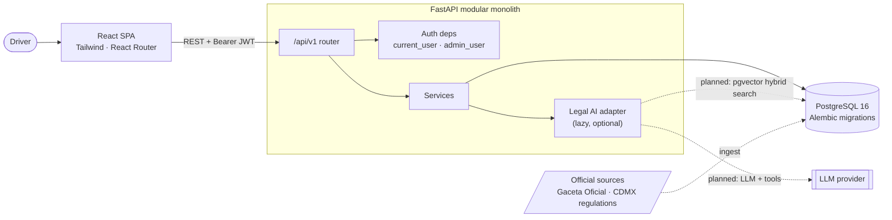

<div align="center">

# Avizum

**Know your rights on the road.**
A traffic-law assistant for Mexico City drivers: verify that an officer is authorized to fine you, understand your infraction, and learn the regulation, all grounded in official sources.




</div>

---

## Why this exists

In Mexico City, a traffic stop is an asymmetric situation: most drivers don't know which officers are legally authorized to issue fines, which article applies, how much a fine really is, or how to contest it. The information is public, but it is scattered across PDFs, the official gazette and government portals.

Avizum puts it in one place, in plain Spanish, and never invents an answer. If the system can't ground a response in an official document, it says so instead of guessing.

## What it does

| | Feature | Status |
|---|---|---|
| 🪪 | **Officer verification.** Look up a badge number against the registry of officers authorized to issue fines on public roads. | Working |
| 📚 | **Driver's guide.** Ten searchable categories (fines, impound, vehicle procedures, emissions and *Hoy No Circula*, accidents, myths vs. reality…), each article citing its source and last update. | Working |
| 🧮 | **Calculators.** UMA → pesos for fines, and a verification-period finder by license plate. | Working |
| 👤 | **Accounts and roles.** Email + password auth, profile management, role-based admin API. | Working |
| 💬 | **Legal assistant.** Chat agent with tools and RAG over current CDMX legislation, with citations that open the official PDF at the right page. | Designed, in progress ([roadmap](#roadmap)) |

> **Honest status:** this is an actively developed project, not a finished product. The legal assistant is specified and planned in detail but not yet implemented. The legacy prototype is disabled and returns HTTP 503 rather than a fabricated answer.

## Screenshots

<table>
  <tr>
    <td width="50%"></td>
    <td width="50%"></td>
  </tr>
  <tr>
    <td align="center"><sub>Officer verification against the registry (demo data)</sub></td>
    <td align="center"><sub>Email + password login, JWT session</sub></td>
  </tr>
  <tr>
    <td width="50%"></td>
    <td width="50%"></td>
  </tr>
  <tr>
    <td align="center"><sub>Logged-in home and searchable driver's guide</sub></td>
    <td align="center"><sub>UMA → pesos calculator (2026 value: $117.31)</sub></td>
  </tr>
</table>

## Architecture



**Key design decisions**

- **Modular monolith, not microservices.** One FastAPI app, one PostgreSQL database, one deployable. Route handlers stay thin; reusable logic lives in `app/services/`.
- **Identity comes from the token, never the request.** Ownership checks (for example on conversations and feedback) always compare against the JWT subject. There is no self-service admin signup: registration always creates the `user` role, and only an existing admin can change roles.
- **Passwords use Argon2** (`pwdlib`). JWT is a Bearer token.
- **Alembic is the schema source of truth.** The test suite runs against real PostgreSQL, not SQLite, so Postgres-only behavior such as native enum columns is actually exercised.
- **Conversations, messages and per-message feedback are separate tables**, so a user's message is recorded even if answer generation fails halfway.
- **The assistant declines rather than improvises.** Answers must come from retrieved official sources; without grounds it says so.
- **Security-minded about data.** Official sources are downloaded over verified TLS and versioned by SHA-256; the legacy pickle-based FAISS index was removed rather than trusted, and the vectors now live in PostgreSQL (pgvector).

## The legal assistant: design

> Status: fully specified ([277-line design spec](docs/superpowers/specs/2026-10-08-asistente-legal-design.md) and a [Phase 0 implementation plan](docs/superpowers/plans/2026-10-08-fase-0-datos-oficiales.md)); implementation starts with the data pipeline.

Legal answers have a failure mode that ordinary chatbots don't tolerate: a confident, wrong article number. The design treats that as the central problem.

**Official sources only.** The corpus is the Reglamento de Tránsito, Ley de Movilidad, Ley de Cultura Cívica, Ley de Procedimiento Administrativo and related CDMX texts (the first four PDFs are already in [`data/legal-sources/`](data/legal-sources/)). Each source is downloaded from its official URL and stored with its SHA-256, declared reform date and retrieval date, so an answer can always be traced to an exact document version. The indexed PDF is the same file the citation opens, so `#page=N` lands on the right page.

**Retrieval built around how laws are written.**

- Chunk by **article**, split by **fraction** when long, with the heading path (`Reglamento › Título III › Art. 30, fr. II`) prepended before embedding.
- **Hybrid search** in plain PostgreSQL: pgvector cosine similarity plus Spanish full-text search, merged with Reciprocal Rank Fusion. Vectors handle paraphrase ("me pasé el alto"); full-text handles exact references ("art. 30 fr. II"), where embeddings are weak.
- No extra vector database: one Postgres instance, which keeps hosting free-tier friendly.

**An agent with tools, not a prompt with a PDF.** A LangChain agent calls `buscar_legislacion`, `obtener_articulo` (to follow cross-references), `buscar_agente` and `calcular_multa`. Fine arithmetic is delegated to code: the model is forbidden from computing fines itself, and the tool applies the UMA value, the art. 64 sanction rule and the 50% early-payment discount.

**Refusal is a feature.**

- Every legal claim must carry a `[n]` marker mapped to a real retrieved passage; markers that match nothing are stripped and logged as anomalies.
- Below a calibrated similarity threshold, the tool returns "no relevant results" and the agent declines instead of improvising.
- Out-of-scope questions (other states, including Estado de México) get a polite refusal.
- The agent never says a person is "fake". It reports whether they appear in the current official list and what to do if not.

**Data integrity, not just data.** The authorized-officer registry comes from a single source, SSC *Acuerdo 30/2026* in the Gaceta Oficial (717 portable-device entries, 570 camera-system entries). The import validates counts against the totals the decree declares and fails if they don't match. The previous CSV was silently missing records, which is exactly what this check prevents. Press reports are explicitly not accepted as a source.

**Measured, not vibes.** A retrieval eval set (recall@5 ≥ 0.80 gate) arrives with the first RAG phase. A fuller ~60-case evaluation follows: tool-choice accuracy, faithfulness (LLM-as-judge), citation accuracy, correct-refusal rate, cost and latency. It compares `gpt-5-mini` against `gpt-5-nano` and publishes the report.

**Cost and abuse controls.** 40 messages/user/day, 2,000-character cap, 12-message context window, 1,200 output tokens, max 6 tool steps per turn. Worst case per user is roughly USD 0.08/day.

## Engineering practices

- **Spec → plan → implementation.** Features start as a written design and a task-by-task plan (see [`docs/superpowers/`](docs/superpowers/)): about 4,500 lines of specs and plans covering auth, the driver's guide and the assistant.
- **A bug found and root-caused in the open.** The email-only auth [spec](docs/superpowers/specs/2026-09-06-email-only-auth-design.md) documents why registration could never succeed (the form sent an email as `username`, which the validator's regex rejected) and removes the field entirely.
- **Tests run against real PostgreSQL** rather than SQLite, with per-test schema creation, so database-specific behavior is exercised.
- **Security by default:** Argon2, no client-supplied identity, no self-service admin, and a deserialization-unsafe index rejected unless explicitly allowed.

## Tech stack

| Layer | Technology |
|---|---|
| Frontend | React 19, React Router 7, Tailwind CSS, Axios, Recharts |
| Backend | Python 3.11+, FastAPI, SQLAlchemy 2, Pydantic v2, Alembic, `uv` |
| Database | PostgreSQL 16 (Docker Compose for local development) |
| Auth | JWT (Bearer), Argon2 password hashing |
| Testing | pytest against PostgreSQL, React Testing Library |
| Planned AI | LangChain agent, pgvector hybrid retrieval (vector + Spanish full-text, RRF), SSE streaming |

## Quick start

**Prerequisites:** [uv](https://docs.astral.sh/uv/), Node.js 18+, Docker (for PostgreSQL). On WSL, enable Docker Desktop's WSL integration.

```bash
# 1. Database
docker compose up -d db

# 2. Backend (http://localhost:8000, docs at /docs)
cd backend
cp .env.example .env            # set JWT_SECRET_KEY
uv sync --group dev
uv run alembic upgrade head
uv sync --group dev --group ingest
uv run python -m scripts.fetch_sources       # download and register official sources (data/sources.json)
uv run python -m scripts.import_agents       # import the current authorized-agents acuerdo
uv run uvicorn app.main:app --reload --host 0.0.0.0

# 3. Frontend (http://localhost:3000), in another terminal
cd frontend
npm install
npm start
```

Create an account in the UI, then promote it to admin if you want the admin panel:

```bash
uv run python -m scripts.promote_admin you@example.com
```

Run the tests (needs the `db` container running, or `TEST_DATABASE_URL`):

```bash
cd backend && uv run pytest
```

Set `REACT_APP_API_URL` in `frontend/.env` if the API isn't at `http://localhost:8000/api/v1`.

## API overview

All routes are under `/api/v1`. Interactive docs are served at `/docs`.

| Method | Route | Auth | Purpose |
|---|---|---|---|
| `GET` | `/health` | public | Health check |
| `POST` | `/auth/register` | public | Create a `user` account |
| `POST` | `/auth/login` | public | Exchange credentials for a JWT |
| `GET` `PATCH` | `/users/me` | user | Read or update own profile |
| `GET` | `/agents/search?q=` | public | Check whether an officer is authorized (by plate or name) |
| `GET` | `/admin/users` | admin | List users |
| `PATCH` | `/admin/users/{id}` | admin | Change a user's role |
| `GET` | `/admin/statistics` | admin | Usage statistics |

## Repository layout

```text
frontend/            React SPA (components, pages, services, driver's-guide content)
backend/             FastAPI app, Alembic migrations, tests
  app/api/           Routes and auth dependencies
  app/core/          Config and security
  app/models/        SQLAlchemy models
  app/schemas/       Pydantic request/response models
  app/services/      Business logic and integrations
data/
  sources.json       Manifest of official sources (URL, reform date, expected counts)
  legal-sources/     Official legal PDFs (downloaded by scripts.fetch_sources, not committed)
database/schema.sql  Reference schema (Alembic is authoritative)
docs/superpowers/    Design specs and implementation plans
```

`backend/node-api/` and `ai/` are legacy prototypes kept only as reference. They are not run and receive no new features.

## Disclaimer

Avizum provides general orientation based on public legal documents. It does not replace professional legal advice or the intervention of competent authorities.

## Authors

Built by students of the Escuela Superior de Cómputo (ESCOM), Instituto Politécnico Nacional.
